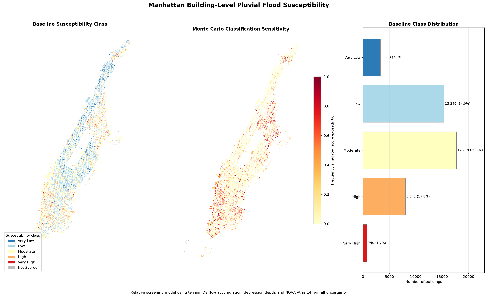

# Manhattan Building-Level Pluvial Flood Susceptibility

A reproducible geospatial screening model that evaluates relative pluvial-flood susceptibility for 45,195 Manhattan buildings using terrain, hydrologic routing, NOAA Atlas 14 rainfall estimates, and Monte Carlo uncertainty analysis.



## Project Overview

Short-duration extreme rainfall can produce localized surface flooding when runoff concentrates in low-lying, flat, or poorly drained terrain.

This project develops a building-level screening workflow for Manhattan by integrating:

- NYC building footprints;
- a 5-meter NOAA topobathymetric DEM;
- elevation and terrain slope;
- filled-depression depth;
- D8 flow accumulation;
- spatially varying NOAA Atlas 14 rainfall estimates;
- 10,000 correlated Monte Carlo rainfall scenarios.

The result is a relative susceptibility score from 0 to 100 for each building. It is intended for screening and prioritization rather than predicting flood depth or the probability that an individual building will flood.

## Key Results

- **45,195** Manhattan building footprints processed.
- **45,169 buildings (99.94%)** received complete terrain and hydrologic attributes.
- **26 buildings** were retained but marked as `Not Scored`.
- **5-meter** terrain analysis resolution.
- **5 NOAA Atlas 14 reference locations** used to represent spatial rainfall variation.
- **10,000 Monte Carlo scenarios** used to propagate rainfall-estimate uncertainty.
- **36.65 MB** final building-level GeoPackage generated.

### Baseline Susceptibility Distribution

| Susceptibility class | Score range | Buildings | Share |
|---|---:|---:|---:|
| Very Low | 0–20 | 3,313 | 7.3% |
| Low | 20–40 | 15,346 | 34.0% |
| Moderate | 40–60 | 17,718 | 39.2% |
| High | 60–80 | 8,042 | 17.8% |
| Very High | 80–100 | 750 | 1.7% |

The classes use fixed score thresholds rather than quantile-based bins. Therefore, the model does not force an equal number of buildings into each category.

## Data Sources

### Building Footprints

Building geometries were obtained from the official NYC Open Data Building Footprints dataset.

- Dataset ID: `5zhs-2jue`
- Buildings included: 45,195
- Original projected CRS: `EPSG:2263`

### Terrain

Terrain information was derived from the NOAA 2017 New York City Topobathymetric LiDAR hydro-enforced DEM.

The DEM was processed to:

- cover the Manhattan analysis area;
- use a 5-meter analysis resolution;
- use `EPSG:6539`;
- preserve elevations in NAVD88 meters.

### Rainfall

The rainfall scenario represents a:

- **100-year average recurrence interval**;
- **30-minute duration**;
- **NOAA Atlas 14 partial-duration-series estimate**.

Five reference locations were used:

| Location | Estimate (in) | 90% lower bound (in) | 90% upper bound (in) |
|---|---:|---:|---:|
| Inwood | 2.216 | 1.564 | 3.144 |
| Columbia University | 2.255 | 1.606 | 3.184 |
| Upper East Side | 2.268 | 1.642 | 3.125 |
| Midtown | 2.269 | 1.639 | 3.141 |
| Lower Manhattan | 2.276 | 1.626 | 3.207 |

Rainfall estimates were interpolated to individual buildings using inverse-distance weighting:

$$
P_b =
\frac{\sum_{i=1}^{5} w_{bi}P_i}
{\sum_{i=1}^{5}w_{bi}},
\qquad
w_{bi} = \frac{1}{d_{bi}^{2}}
$$

where:

- \(P_b\) is the interpolated precipitation depth for building \(b\);
- \(P_i\) is the NOAA estimate at reference location \(i\);
- \(d_{bi}\) is the distance from building \(b\) to location \(i\).

## Methodology

### 1. Building-Footprint Processing

NYC building geometries were downloaded, filtered to Manhattan, validated, and stored in a projected GeoPackage.

### 2. Terrain Preparation

The NOAA source DEM was downloaded, mosaicked, clipped to the analysis area, reprojected, and resampled to a consistent 5-meter grid.

### 3. Terrain and Hydrologic Features

Four building-level susceptibility components were constructed.

#### Low Elevation

Buildings at lower relative elevations receive higher component scores.

#### Terrain Flatness

Slope was calculated using a Horn 3 × 3 neighborhood:

$$\mathrm{slope}=\arctan\left(\sqrt{\left(\frac{\partial z}{\partial x}\right)^2+\left(\frac{\partial z}{\partial y}\right)^2}\right)$$

Flatter terrain receives a higher susceptibility component because surface water generally drains more slowly where the local gradient is small.

#### Depression Depth

Hydrologic conditioning was used to fill pits and depressions in the DEM. Depression depth was calculated as the difference between the conditioned and original elevation surfaces.

Larger depression depths indicate greater potential for localized surface-water storage.

#### Flow Accumulation

D8 flow routing assigns each grid cell's flow to one of its eight neighboring cells. Flow accumulation measures the number of upstream cells draining through each location.

For each building, the model uses the maximum flow accumulation within approximately 10 meters to account for nearby runoff-concentration paths.

### 4. Component Standardization

Each terrain variable was converted into an empirical score between 0 and 1:

- lower elevation → higher score;
- lower slope → higher score;
- greater depression depth → higher score;
- greater flow accumulation → higher score.

This places variables with different physical units on a comparable scale.

### 5. Composite Susceptibility Score

Without observed building-level flood claims or measured inundation depths, there is insufficient evidence to statistically calibrate component weights. The baseline model therefore uses equal weights:

$$
T_b =
0.25E_b+
0.25S_b+
0.25D_b+
0.25F_b
$$

where:

- \(E_b\) is the low-elevation component;
- \(S_b\) is the flatness component;
- \(D_b\) is the depression-depth component;
- \(F_b\) is the flow-accumulation component.

The terrain score is adjusted using the local NOAA rainfall estimate:

$$
H_b =
T_b
\left(
\frac{P_b}{\widetilde{P}}
\right)
$$

where \(\widetilde{P}\) is the median interpolated rainfall estimate across eligible Manhattan buildings.

The final baseline score is:

$$
\text{Score}_b =
100 \times \min(1,\max(0,H_b))
$$

### 6. Monte Carlo Uncertainty Analysis

NOAA point estimates and 90% confidence intervals were converted into location-specific lognormal rainfall distributions.

The model generated 10,000 spatially correlated rainfall scenarios using a shared citywide random draw in each simulation. This preserves the assumption that a single extreme storm affects rainfall conditions across all five Manhattan reference locations simultaneously.

For every eligible building, the model records:

- mean simulated score;
- score standard deviation;
- 5th-percentile score;
- median score;
- 95th-percentile score;
- frequency that the simulated score exceeds 60;
- frequency that the simulated score exceeds 80.

The exceedance frequencies measure classification sensitivity to NOAA rainfall-estimate uncertainty. They are not estimates of flood probability.

## Model Workflow

1. Download and validate Manhattan building footprints.
2. Download and preprocess the NOAA DEM.
3. Calculate slope and hydrologically condition the terrain.
4. Calculate depression depth and D8 flow accumulation.
5. Sample terrain and hydrologic attributes to buildings.
6. Retrieve and validate NOAA Atlas 14 rainfall estimates.
7. Interpolate rainfall estimates to building locations.
8. Construct standardized susceptibility components.
9. Calculate baseline susceptibility scores and classesR
10. Propagate rainfall uncertainty through Monte Carlo simulation.
11. Export final building-level results and portfolio figures.

## Repository Structure

```text
manhattan-pluvial-flood-risk/
├── data/
│   ├── raw/
│   └── processed/
├── notebooks/
│   ├── 01_environment_check.ipynb
│   ├── 02_building_footprints.ipynb
│   ├── 03_terrain_data.ipynb
│   ├── 04_terrain_features.ipynb
│   ├── 05_rainfall_scenarios.ipynb
│   └── 06_building_risk_model.ipynb
├── outputs/
│   ├── manhattan_100yr_30min_rainfall_scenarios.png
│   ├── manhattan_spatial_rainfall_baseline.png
│   └── manhattan_building_flood_susceptibility.png
├── .gitignore
├── README.md
└── requirements.txt